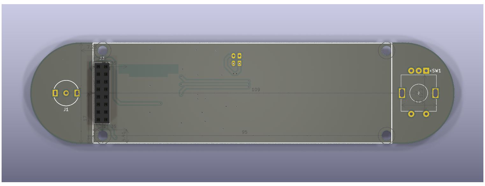
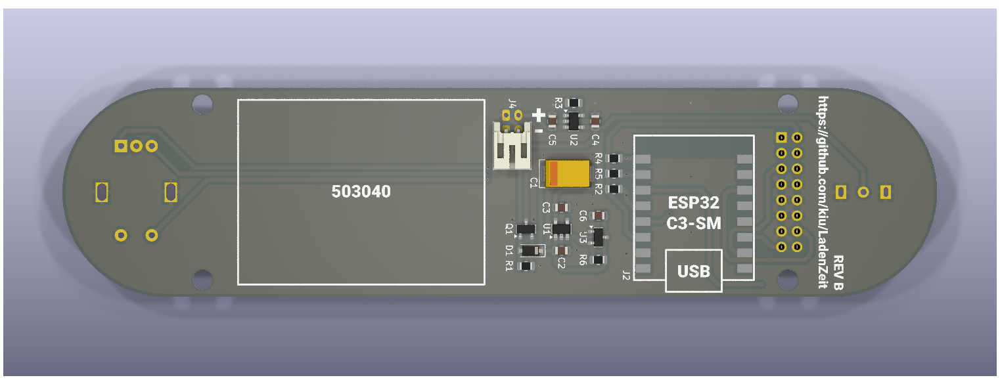
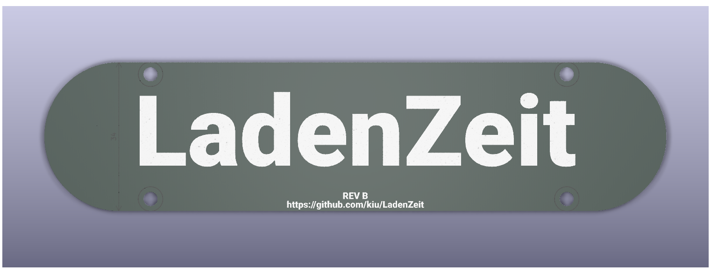
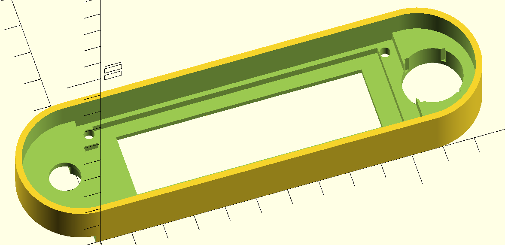

# LadenZeit
LadenZeit - TBD

## Device

- [main](hardware/REV_B/main/): The main PCB
- [plate](hardware/REV_B/plate/): PCB used as backplate
- [mech](hardware/REV_B/mech/): OpenSCAD case
- [BOM](hardware/REV_B/LadenZeit-bom.pdf): Bill of materials

### Firmware (Arduino IDE)

- [source](firmware/LadenZeit/)
- [UI flow](firmware/ladenzeit-ui-flow.drawio.png)

Arduino IDE config
- Board: [ESP32C3 Dev Module](https://github.com/espressif/arduino-esp32)
- Library: [U8g2](https://github.com/olikraus/u8g2)
- Library: [ESP32Time](https://github.com/fbiego/ESP32Time)
- Config: "USB CDC On Boot: Enabled"
- Config: "CPU Frequency: 80MHz (WiFi)"
- Config: "Partition Scheme: Huge APP (3MB No OTA/1MB SPIFFFS)"

## Server (Java Spring Boot)

- [source](server/LadenZeitServer)
- [frontend](server/index.html)
- [service](server/ladenzeit.service)

Inject Google Maps API key via environment.

# License
This project is licensed under the Creative Commons Attribution-NonCommercial 3.0 Unported (CC BY-NC 3.0) license.
